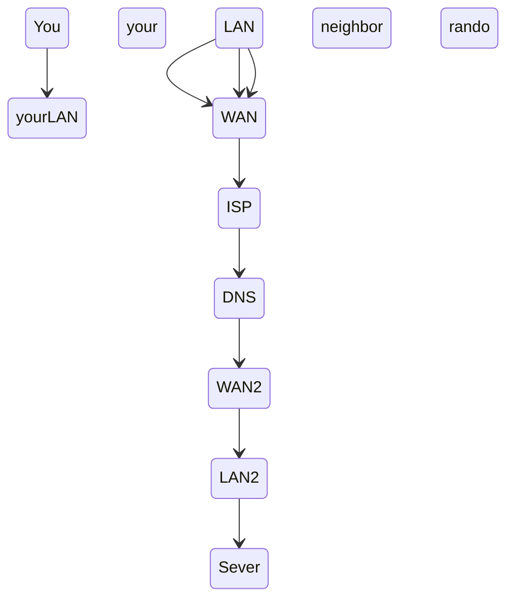

# Introduction to Web Development

```mermaid
stateDiagram-v2
    You --> yourLAN
    your LAN --> WAN
    neighbor LAN --> WAN
    rando LAN --> WAN
    WAN --> ISP
    ISP --> DNS
    DNS --> WAN2
    WAN2 --> LAN2
    LAN2 --> Sever
```

