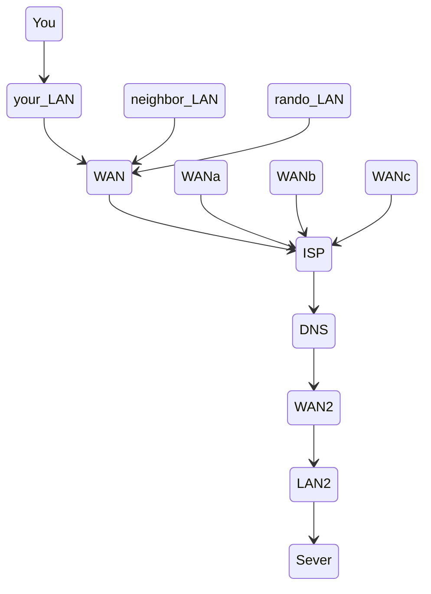

# Introduction to Web Development

```mermaid
stateDiagram-v2
    You --> your_LAN
    your_LAN --> WAN
    neighbor_LAN --> WAN
    rando_LAN --> WAN
    WAN --> ISP
    WANa --> ISP
    WANb --> ISP
    WANc --> ISP
    ISP --> DNS
    DNS --> WAN2
    WAN2 --> LAN2
    LAN2 --> Sever
```

