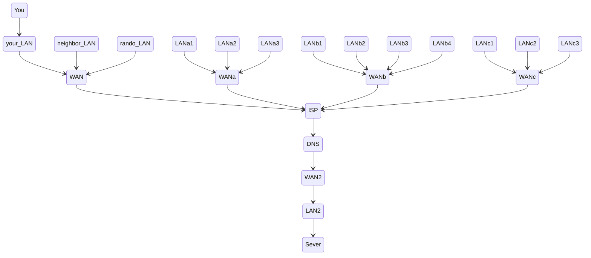

# Introduction to Web Development

```mermaid
stateDiagram-v2
    You --> your_LAN
    your_LAN --> WAN
    neighbor_LAN --> WAN
    rando_LAN --> WAN
    WAN --> ISP
    LANa1 --> WANa
    LANa2 --> WANa
    LANa3 --> WANa
    WANa --> ISP
    LANb1 --> WANb
    LANb2 --> WANb
    LANb3 --> WANb
    LANb4 --> WANb
    WANb --> ISP
    LANc1 --> WANc
    LANc2 --> WANc
    LANc3 --> WANc
    WANc --> ISP
    ISP --> DNS
    DNS --> WAN2
    WAN2 --> LAN2
    LAN2 --> Sever
```

