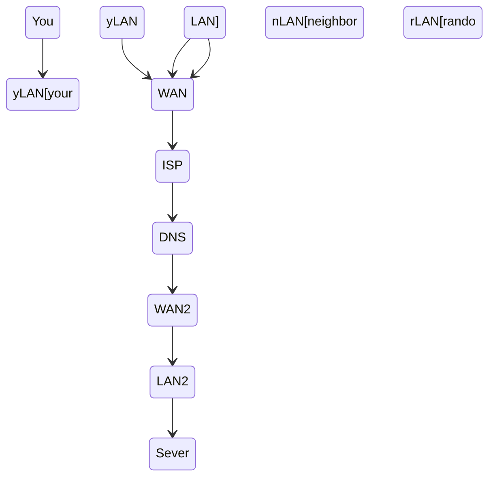

# Introduction to Web Development

```mermaid
stateDiagram-v2
    You --> yLAN[your LAN]
    yLAN --> WAN
    nLAN[neighbor LAN] --> WAN
    rLAN[rando LAN] --> WAN
    WAN --> ISP
    ISP --> DNS
    DNS --> WAN2
    WAN2 --> LAN2
    LAN2 --> Sever
```

